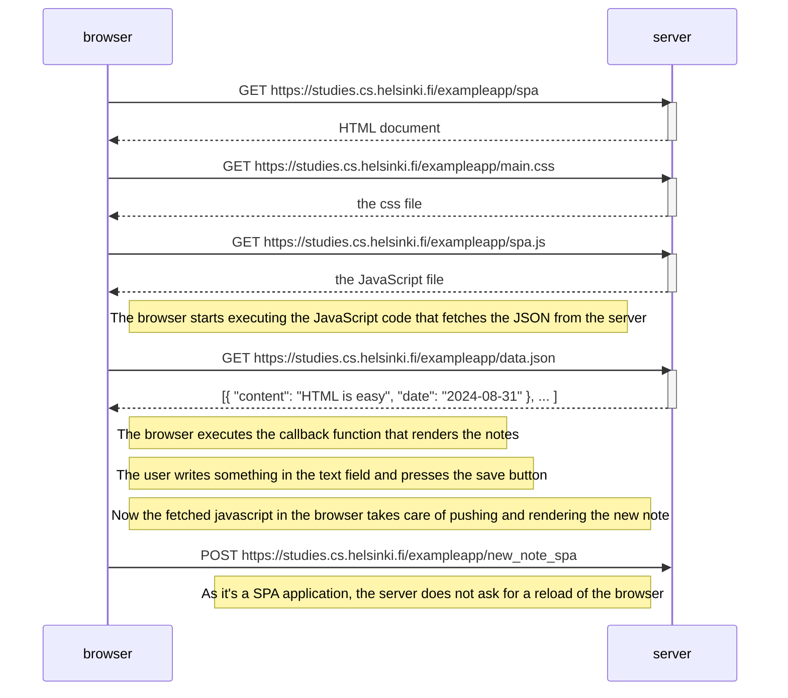

```mermaid
sequenceDiagram
  participant browser
  participant server

    browser->>server: GET https://studies.cs.helsinki.fi/exampleapp/spa
    activate server
    server-->>browser: HTML document
    deactivate server

    browser->>server: GET https://studies.cs.helsinki.fi/exampleapp/main.css
    activate server
    server-->>browser: the css file
    deactivate server

    browser->>server: GET https://studies.cs.helsinki.fi/exampleapp/spa.js
    activate server
    server-->>browser: the JavaScript file
    deactivate server

    Note right of browser: The browser starts executing the JavaScript code that fetches the JSON from the server

    browser->>server: GET https://studies.cs.helsinki.fi/exampleapp/data.json
    activate server
    server-->>browser: [{ "content": "HTML is easy", "date": "2024-08-31" }, ... ]
    deactivate server

    Note right of browser: The browser executes the callback function that renders the notes

    Note right of browser: The user writes something in the text field and presses the save button

    Note right of browser: Now the fetched javascript in the browser takes care of pushing and rendering the new note

    browser->>server: POST https://studies.cs.helsinki.fi/exampleapp/new_note_spa

    Note left of server: As it's a SPA application, the server does not ask for a reload of the browser
```
